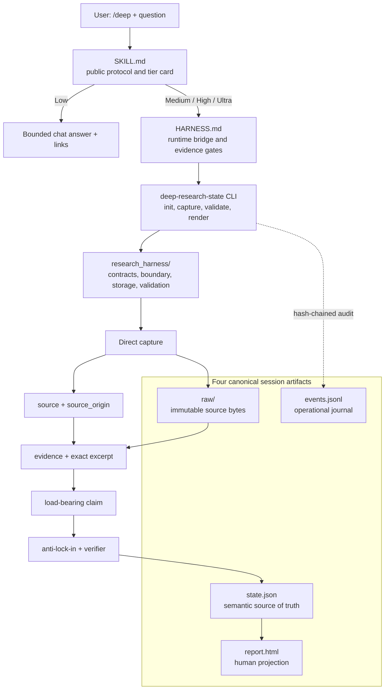

# Agent Deep Research Trigger

[](https://github.com/jechiu16/agent-deep-research-trigger/actions/workflows/ci.yml)
[](https://github.com/jechiu16/agent-deep-research-trigger/releases)
[](LICENSE)

**Research for coding agents should end in a decision, not a pile of plausible
prose.** This portable `/deep` skill gives Claude Code and OpenAI Codex a
bounded, evidence-gated way to investigate difficult questions and hand the
result to the next coding session.

[繁體中文](README.zh-TW.md) · [Releases](https://github.com/jechiu16/agent-deep-research-trigger/releases)

## Why This Exists

A direct Deep Research call is useful for exploration, but it can leave three
problems for development work: unclear request cost, citations that do not
actually support the load-bearing claims, and a long report the next session
must reread from scratch. `/deep` is for developers who want the host agent to
retain the breadth of research while producing a bounded decision, explicit
uncertainty, direct evidence, and an actionable handoff.

## What You Get

Low returns a concise answer with links. Medium, High, and Ultra create one
session package with four canonical artifacts: machine state, an audit journal,
immutable source bytes, and a Traditional Chinese HTML report. The useful face
of that package is deliberately small:

> recommendation · supporting evidence · limits and flip conditions · next
> reversible coding action and acceptance tests

The next agent reads `state.json`; a human reads `report.html`. Both are bound
to the same evidence and status instead of receiving two independently written
reports.

## How Quality Is Earned

- Load-bearing claims trace to exact excerpts from direct captures; provider
  synthesis can guide discovery but cannot stand in for evidence.
- Evidence or delivery shortfalls fail closed as `BLOCKED`, never a convenient
  `PASS`; High and Ultra add anti-lock-in checks and a context-separated verifier.
- In both retained identity-blind output comparisons, the `/deep` result was
  preferred for the evaluated task. These are bounded examples, not a claim of
  universal superiority or provider ranking.

## Architecture



## Glossary

- **Organizer:** the currently selected Claude Code or Codex host model. It owns
  framing, evidence reconciliation, the final verdict, and the coding handoff.
- **D1 / D2:** the exact Deep Research submits authorized on an Ultra card. D1
  runs first; after the High checkpoint the Organizer may stop or use optional D2.
- **Anti-lock-in:** an active attempt to overturn a provisional conclusion;
  every result must be refuted, absorbed into a revision, or left as a named tension.
- **Direct capture:** fetched source bytes plus an exact excerpt and provenance.
  Only qualifying captures may support canonical claims.
- **Source-origin independence:** evidence produced by genuinely different
  upstream origins, not two URLs, mirrors, indexes, or models repeating one source.
- **Context-separated verifier:** a fresh pass over the final claim packet by an
  actor that did not produce the candidate; it checks the packet but does not by
  itself prove source or context independence.

## Quickstart

1. **Install the tagged skill and runtime.**

```bash
git clone https://github.com/jechiu16/agent-deep-research-trigger.git \
  "$HOME/.agent-deep-research-trigger"
cd "$HOME/.agent-deep-research-trigger"
git checkout v2.0.0b8
python3 -m venv .venv
.venv/bin/python -m pip install -e .
```

2. **Link it to one host.**

```bash
# Claude Code
mkdir -p "$HOME/.claude/skills"
ln -s "$PWD" "$HOME/.claude/skills/deep"

# Or OpenAI Codex
mkdir -p "$HOME/.agents/skills"
ln -s "$PWD" "$HOME/.agents/skills/deep"
```

3. **Start a fresh session** so the host discovers the linked skill.

4. **Type `/deep` with a research question, then choose a tier.**

```text
/deep Compare SQLite and DuckDB as the default local analytics engine.
```

## Tiers

| Tier | Result |
|---|---|
| Low | Chat answer with links; no runtime package. |
| Medium | Direct evidence for a named gap plus a package. |
| High | At least two qualifying captures plus a package. |
| Ultra | High plus an adaptive Deep loop; the card names exact D1 and optional D2 routes with max total 1 or 2, and the Organizer may stop or use D2 within that envelope. |

Host-native work is the default. Optional external provider calls are used only
when disclosed on the card.
The initial Ultra card names exact D1 and exact optional D2 routes from OpenAI, Perplexity, or Gemini; the Organizer only decides stop/run D2 inside that envelope. Provider synthesis is discovery-only and direct captures support claims.

## Outputs

Medium, High, and Ultra deliver:

| Output | Purpose |
|---|---|
| `state.json` | Canonical JSON with machine-readable state, claims, and evidence links. |
| `events.jsonl` | Hash-chained operational and revision journal. |
| `raw/` | Immutable, hashed, policy-gated source and local bytes. |
| `report.html` | `zh-Hant-TW` conclusion, limitations, status, and coding handoff. |

Evidence or delivery gaps still produce a blocked package, never `PASS`. The
HTML identifies `EVIDENCE_INSUFFICIENT` or `DELIVERY_INCOMPLETE` as applicable.

## Two Bounded Examples

- [SQLite WAL blind comparison](examples/paired/2026-07-13-sqlite-wal-blind/): one identity-blind output comparison, not evidence of general superiority.
- [RFC 9110 Ultra blind comparison](examples/paired/2026-07-13-rfc9110-ultra-blind/): output-level integration evidence only, not full-runtime evidence, general superiority, or provider ranking.

Both suites retain their user-visible task, candidate outputs, verdict materials, and provenance.

## Project Links

- [SKILL.md](SKILL.md): public `/deep` protocol
- [HARNESS.md](HARNESS.md): Medium/High/Ultra internal runtime bridge and gates
- [examples/v2](examples/v2): runtime fixture
- [CONTRIBUTING.md](CONTRIBUTING.md): development and release checks
- [SECURITY.md](SECURITY.md): private security reporting

## License

[MIT](LICENSE)
