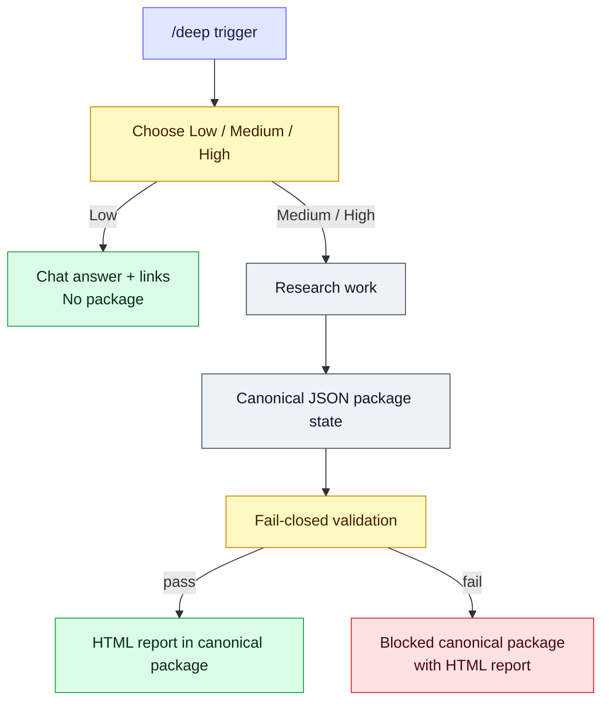

# Agent Deep Research Trigger

[](https://github.com/jechiu16/agent-deep-research-trigger/actions/workflows/ci.yml)
[](https://github.com/jechiu16/agent-deep-research-trigger/releases)
[](pyproject.toml)
[](LICENSE)

**A portable `/deep` research agent skill for Claude Code and OpenAI Codex.**
It turns an explicit trigger into a bounded, cost-aware, evidence-gated research
session with resumable multi-provider execution and a deterministic report.

[繁體中文](README.zh-TW.md) ·
[Release](https://github.com/jechiu16/agent-deep-research-trigger/releases)

## Contents

[Quickstart](#quickstart) · [Why this exists](#why-this-exists) · [How it works](#how-it-works) ·
[Optional setup](#optional-setup) · [Development and release quality](#development-and-release-quality) · [Project map](#project-map)

## Quickstart

The default path needs no provider key: host-native search/fetch and local tools
are used first.

1. **Install the skill.** Clone it and install its package:

```bash
git clone https://github.com/jechiu16/agent-deep-research-trigger.git \
  "$HOME/.agent-deep-research-trigger"
cd "$HOME/.agent-deep-research-trigger"

python3 -m venv .venv
.venv/bin/python -m pip install -e .
```

2. **Link it to one host.** Choose Claude Code or Codex:

```bash
# Claude Code
mkdir -p "$HOME/.claude/skills"
ln -s "$PWD" "$HOME/.claude/skills/deep"

# Or OpenAI Codex
mkdir -p "$HOME/.agents/skills"
ln -s "$PWD" "$HOME/.agents/skills/deep"
```

3. **Start a fresh session.** Open a new Claude Code or Codex session so the
   host discovers the skill.

4. **Type `/deep` and choose a tier.** For example:

```text
/deep Compare SQLite and DuckDB as the default local analytics engine.
```

Choose exactly one of:

| Tier | Result |
|---|---|
| Low | Chat-only answer with links; no package is created. |
| Medium | Adaptive research that always delivers the canonical package with JSON and `zh-Hant-TW` HTML. |
| High | Multiple direct sources that always deliver the canonical package with JSON and `zh-Hant-TW` HTML. |

Medium and High always deliver the canonical package. If validation or the
evidence floor fails, the package is still delivered with a
`blocked/evidence-insufficient` status rather than omitted.

The host-native path is the default. Add provider credentials only when a
specific external route is needed.

## Why this exists

Deep-research agents are useful, but ordinary orchestration often leaves
evidence, source lineage, and delivery quality implicit.

Agent Deep Research Trigger makes those constraints executable:

- `/deep` is an explicit trigger, and the selected tier sets the research depth;
- host-native retrieval and local inspection are preferred before optional
  provider routes;
- paid requests reserve their exact physical multiplicity atomically inside the
  request boundary;
- paid asynchronous submissions are never silently resubmitted;
- provider bytes are spooled before parsing;
- state changes are revision-checked and crash-recoverable;
- claims must trace to evidence and source origins;
- a final verdict passes only after fail-closed validation clears the evidence floor;
- HTML output is rendered deterministically from one canonical JSON state.

## How it works



Medium and High deliveries always include the canonical package, even when
validation fails. A validation or evidence-floor failure sets its status to
`blocked/evidence-insufficient`; it does not suppress any artifact:

| Artifact | Purpose |
|---|---|
| `state.json` | Canonical semantic state |
| `events.jsonl` | Append-only operational journal |
| `raw/` | Immutable, provenance-bound provider or local bytes |
| `report.html` | Human view declaring `zh-Hant-TW`, with Traditional Chinese interface copy, original source/evidence text, and the package status |

See [HARNESS.md](HARNESS.md) for the optional implementation and recovery reference.

## Optional setup

### Provider routes

The versioned [provider registry](research_harness/provider_registry.json) is a
policy ledger, not a fan-out pipeline. Host-native search/fetch remains the
default; provider routes are optional and only enabled when their adapter is
v2-bound.

Enabled route classes include:

| Route class | Providers |
|---|---|
| General discovery and challenge | Brave, Sonar, Exa |
| Source of record | GitHub, PyPI, OSV, NVD, IETF |
| Scholarly discovery | OpenAlex, Crossref, Semantic Scholar, Europe PMC |
| Asynchronous investigation | Perplexity Deep Research, OpenAI Deep Research (o4-mini) |
| Host-native and local inspection | — |
| Deterministic no-network test | — |

Exa is enabled for anti-lock-in and verification after a bounded paired-index
benchmark; Brave is the recommended general scout. Listing results cannot
support claims until the decisive source is fetched directly. Other external
worker routes stay disabled until the registry marks them enabled and v2-bound;
a present credential is never execution readiness by itself.

### Demo and CLI

The optional no-network demo needs no API key or cost:

```bash
.venv/bin/deep-research-state demo /tmp/agent-deep-demo --json
```

It is a health check only and cannot support a real claim. For route readiness,
use `.venv/bin/deep-research-state providers`; use `providers --json` for machine
consumers. The installed `deep-research-state` entry point also covers state,
artifact, validation, and rendering operations.

### Credentials and security

Provider credentials are optional. If an external route is needed, copy
`.env.example` to `.env` and add only the providers you intend to use.
Environment variables override the nearest `.env`. Credentials are excluded
from state, events, request fingerprints, fixtures, and artifact names.

Paid requests reserve their exact physical multiplicity atomically inside the
request boundary; a failed or uncertain outbound attempt remains consumed.
Host, local, and Organizer actions are the only actions that may use the legacy
local `permit` command. Monetary estimates remain uncertain; provider-reported
cost is preserved when available.

For the threat model, storage rights, recovery rules, and limitations, read the optional implementation and recovery reference in [HARNESS.md](HARNESS.md) and the [adapter guide](research_harness/adapters/README.md).

### Adding the second host

The same checkout can later be linked to the other host by adding its one
discovery link under `$HOME/.claude/skills/deep` or `$HOME/.agents/skills/deep`.

## Development and release quality

```bash
.venv/bin/deep-research-release-gate
```

The release gate requires a clean worktree and runs:

- unit tests with an 80% core branch-coverage floor;
- Ruff static checks;
- installed-CLI end-to-end demo;
- wheel and source distribution builds plus Twine metadata checks;
- dependency vulnerability audit.

GitHub Actions verifies Python 3.9, 3.12, and 3.13. A version-matching tag publishes a prerelease only after the same gate passes on a clean hosted runner.

## Project map

| Path | Purpose |
|---|---|
| [SKILL.md](SKILL.md) | Canonical Agent Skills workflow |
| [AGENTS.md](AGENTS.md) | Codex repository guidance |
| [HARNESS.md](HARNESS.md) | Optional implementation and recovery reference |
| [research_harness](research_harness) | Contract, state, storage, quota, validation, and rendering runtime |
| [research_harness/adapters](research_harness/adapters) | request-boundary provider adapters |
| [scripts/research_state.py](scripts/research_state.py) | Main JSON-first CLI |
| [docs/benchmarks](docs/benchmarks) | Provider adoption evidence |
| [examples](examples) | Demo artifacts, v2 fixtures, and the calibration eval seed question set |

Contributions should start with [CONTRIBUTING.md](CONTRIBUTING.md). Report
security issues through the private process in [SECURITY.md](SECURITY.md).

## License

[MIT](LICENSE)
