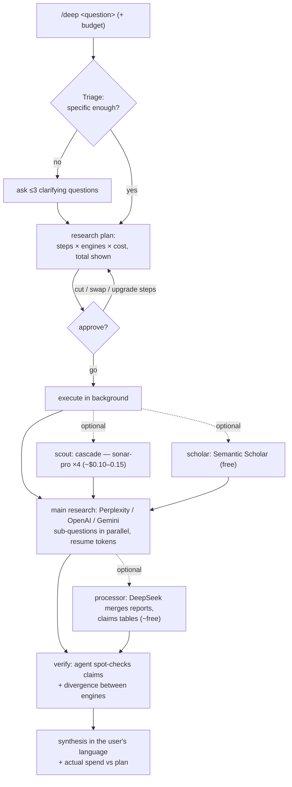

# deep — Universal Research Orchestrator for Claude Code

One `/deep` command that turns any research question into a composed workflow — scout, literature search, deep research, merging, verification — across five engines, from a $0.01 fact-check to a cross-validated multi-engine investigation. Background execution, resumable jobs, cited markdown reports.

## Why

Every research API has a different shape (sync vs async, different polling, citation formats, cost meters). This skill hides that behind one CLI + one agent workflow, and adds the three things raw APIs don't give you:

1. **A plan before spending** — the agent composes a step-by-step research plan (engines × cost × outputs), shows the total, and only launches on your go. The most expensive failure mode of deep research — a $4 run aimed at the wrong question — gets caught at the plan stage.
2. **Role separation** — engines do what they're actually good at: search engines research, Semantic Scholar grounds claims in papers, DeepSeek (no search, hallucination-prone ungrounded) only ever processes already-fetched material.
3. **A verification pass** — the agent spot-checks load-bearing claims with independent web search before presenting conclusions. LLM research reports are hypotheses, not facts.

## Flow



## Building blocks

| Block | Engine | Typical cost | Typical time |
|---|---|---|---|
| scout | `cascade` — 4 parallel sonar-pro probes, merged | ~$0.10–0.15/call | ~30s |
| quick | Perplexity `sonar-pro` | ~$0.01/call | seconds |
| scholar | Semantic Scholar Graph API | free | seconds |
| standard | Perplexity `sonar-deep-research` (medium) | $0.5–1 | 2–5 min |
| deep | OpenAI `o3` / `o4-mini-deep-research`, Perplexity high, or Gemini | $0.4–8 | 5–25 min |
| processor | DeepSeek v4 over `--files` | ~free | 1–5 min |
| panel | two deep engines in parallel, same query | $4–6 | parallel |

## Install

```bash
# 1. Drop this folder at ~/.claude/skills/deep/
# 2. Install deps into whatever python will run it:
pip install requests python-dotenv          # + google-genai for the gemini provider
# 3. Keys:
cp .env.example .env                        # fill in the keys for the providers you'll use
                                            # (scholar even works keyless, at stricter shared-pool limits)
```

Key resolution order: process env → nearest `.env` from your working directory upward → `~/.claude/skills/deep/.env`. Project-local keys win; the skill-local `.env` makes `/deep` work from any directory.

## CLI

```bash
# pick the python that has the deps: project venv first, else system
PY=.venv/Scripts/python.exe   # Windows; POSIX: PY=.venv/bin/python; no venv: PY=python3

"$PY" scripts/deep_research.py --provider sonar                "quick question"
"$PY" scripts/deep_research.py --provider cascade              "scout: 4 probe framings in one call"
"$PY" scripts/deep_research.py --provider scholar              "dynamic factor model nowcasting"
"$PY" scripts/deep_research.py                                 "standard research question"    # perplexity medium
"$PY" scripts/deep_research.py --provider openai --effort high "decision-critical question"    # o3
"$PY" scripts/deep_research.py --provider deepseek --files a.md --files b.md "merge into a claims table"
"$PY" scripts/deep_research.py --resume "openai:resp_abc123"   # recover a dropped job — don't re-pay
```

Output: one JSON object on stdout (`report`, `report_path`, `usage`, `cost_estimate_usd`, `wall_time_s`); progress + resume token on stderr; report saved to `<cwd>/reports/deep_<timestamp>_<slug>.md` with usage, official/estimated cost, and a Sources section.

## Field notes（measured, not vibes）

- Perplexity `reasoning_effort=minimal` is **ungrounded**: bills searches, returns zero citations, writes from parametric memory. Use `medium`+ for real research.
- Perplexity returns an official `usage.cost.total_cost` — reported verbatim. OpenAI returns no cost field; the engine estimates from tokens + search-call count.
- Perplexity usage fields can be `key: null` — the engine is None-safe throughout.
- Perplexity deep research: ~5 RPM on low tiers. Semantic Scholar: 1 request/sec cumulative with a key (engine retries a 429 once; never call scholar in parallel); keyless falls back to the shared pool.
- Report filenames embed a `hash(query + pid)` suffix — parallel probes and pure-CJK queries can't overwrite each other.
- Failed polls exit with `{"error": ..., "resume": "provider:id"}` — an orchestrating agent should resume, never re-pay.
- OpenAI deep-research models require a **verified organization** (one-time, platform.openai.com → settings → Verify Organization).
- DeepSeek thinking models reject `temperature`/`top_p` — the engine never sends them.

## License

MIT
