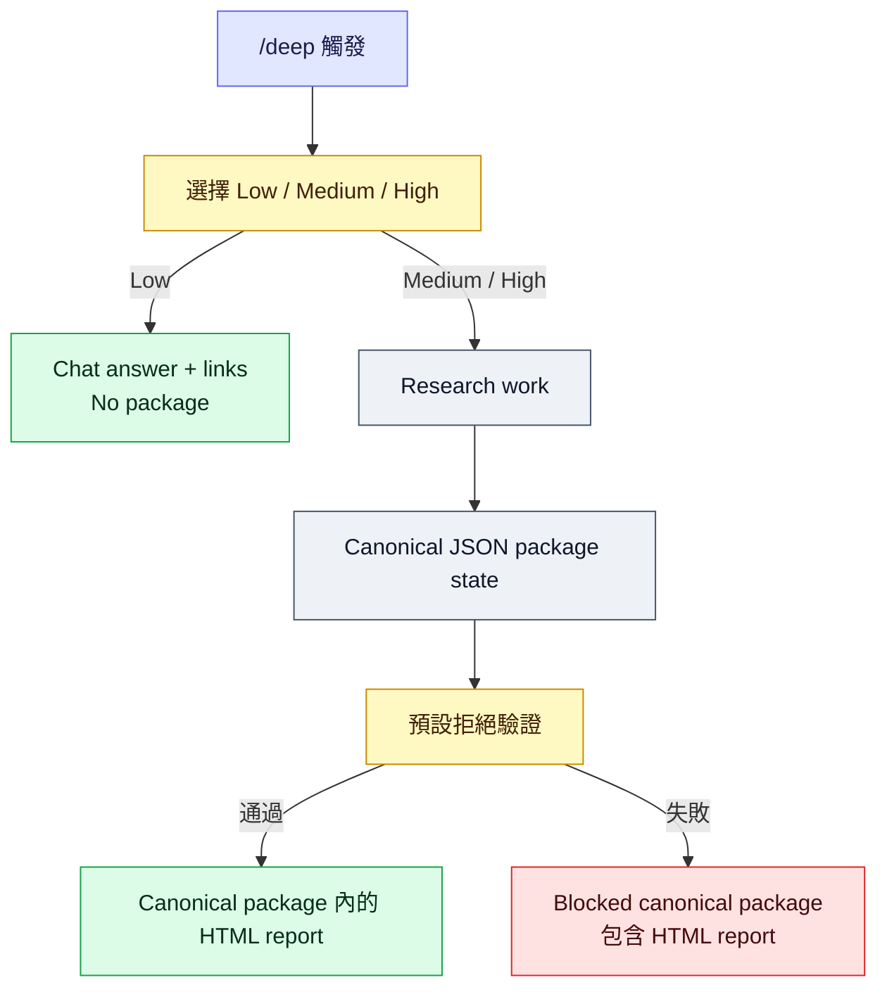

# Agent Deep Research Trigger

[](https://github.com/jechiu16/agent-deep-research-trigger/actions/workflows/ci.yml)
[](https://github.com/jechiu16/agent-deep-research-trigger/releases)
[](pyproject.toml)
[](LICENSE)

**給 Claude Code 與 OpenAI Codex 共用的 `/deep` 研究代理 skill。**
它把明確觸發轉成有邊界、成本可控、證據有 gate、可恢復的多 provider
研究 session，最後從唯一 canonical state 產生 deterministic report。

[English](README.md) ·
[Releases](https://github.com/jechiu16/agent-deep-research-trigger/releases)

## 目錄

- [快速開始](#快速開始)
- [為什麼需要它](#為什麼需要它)
- [運作方式](#運作方式)
- [Optional setup](#optional-setup)
- [開發與 release 品質](#開發與-release-品質)
- [專案地圖](#專案地圖)

## 快速開始

預設流程不需要 provider key：先使用 host-native search/fetch 與 local tools。

1. **安裝 skill。** Clone repository 並安裝 package：

```bash
git clone https://github.com/jechiu16/agent-deep-research-trigger.git \
  "$HOME/.agent-deep-research-trigger"
cd "$HOME/.agent-deep-research-trigger"

python3 -m venv .venv
.venv/bin/python -m pip install -e .
```

2. **連結到一個 host。** 擇一使用 Claude Code 或 Codex：

```bash
# Claude Code
mkdir -p "$HOME/.claude/skills"
ln -s "$PWD" "$HOME/.claude/skills/deep"

# 或 OpenAI Codex
mkdir -p "$HOME/.agents/skills"
ln -s "$PWD" "$HOME/.agents/skills/deep"
```

3. **開啟新的 session。** 開啟新的 Claude Code 或 Codex session，讓 host
   discovery 載入這個 skill。

4. **輸入 `/deep` 並選擇 tier。** 例如：

```text
/deep 比較 SQLite 與 DuckDB，哪個更適合當本機分析引擎預設值？
```

只選一個 tier：

| Tier | 結果 |
|---|---|
| Low | 只在 chat 中回答並附上連結；不建立 package。 |
| Medium | Adaptive research 一律交付包含 JSON 與 `zh-Hant-TW` HTML 的 canonical package。 |
| High | 取得多個直接來源，一律交付包含 JSON 與 `zh-Hant-TW` HTML 的 canonical package。 |

Medium 與 High 一律交付 canonical package。若 validation 或 evidence floor
失敗，仍會交付帶有 `blocked/evidence-insufficient` status 的 package，不會省略。

Host-native 是預設。只有在特定外部 route 需要時，才加入 provider credential。

## 為什麼需要它

一般 research orchestration 常把 evidence、source lineage 與交付品質留在
prompt prose 中。

Agent Deep Research Trigger 把這些限制做成可執行規則：

- `/deep` 是明確 trigger，選定的 tier 決定研究深度；
- 優先使用 host-native retrieval 與 local inspection，再考慮 optional provider route；
- Paid request 在 request boundary 內 atomically reserve 精確的 physical multiplicity；
- 付費 async submission 絕不靜默重送；
- provider bytes 一律先 spool 再 parse；
- state update 有 revision check 並可在 crash 後恢復；
- claim 必須連回 evidence 與 source origin；
- 最終 verdict 只有在 fail-closed validation 通過 evidence floor 後才會 PASS；
- HTML 只從唯一 canonical JSON state deterministic render。

## 運作方式



Medium 與 High delivery 即使 validation 失敗，也一律包含 canonical package。
Validation 或 evidence floor 失敗時，只將 status 設為
`blocked/evidence-insufficient`，不會省略任何 artifact：

| Artifact | 用途 |
|---|---|
| `state.json` | Canonical semantic state |
| `events.jsonl` | Append-only operational journal |
| `raw/` | Immutable、provenance-bound provider／local bytes |
| `report.html` | 宣告 `zh-Hant-TW` 的人類報告，使用 Traditional Chinese 介面文案、保留 source/evidence text 原文，並包含 package status |

[HARNESS.md](HARNESS.md) 是 optional implementation and recovery reference。

## Optional setup

### Provider routes

[Provider registry](research_harness/provider_registry.json) 是 versioned policy
ledger，不是固定 fan-out pipeline。Host-native search/fetch 是預設；provider
route 是 optional，只有 adapter 已 v2-bound 才會啟用。

Enabled route 類型包括：

| Route class | Providers |
|---|---|
| General discovery／challenge | Brave、Sonar、Exa |
| Source of record | GitHub、PyPI、OSV、NVD、IETF |
| Scholarly discovery | OpenAlex、Crossref、Semantic Scholar、Europe PMC |
| Async investigation | Perplexity Deep Research、OpenAI Deep Research（o4-mini） |
| Host-native 與 local inspection | — |
| Deterministic no-network test | — |

Exa 經 bounded paired-index benchmark 後，作為 anti-lock-in／verification route
啟用；Brave 是建議的 general scout。Result listing 必須直接 fetch decisive source
後才能支持 claim。其他 external worker route 維持 disabled，直到 registry 標記
enabled 且 v2-bound；只有 credential 存在，不代表 execution readiness。

### Demo and CLI

可選的 no-network demo 不需要 API key 或成本：

```bash
.venv/bin/deep-research-state demo /tmp/agent-deep-demo --json
```

它只是 health check，不能支援真實 claim。Route readiness 可用
`.venv/bin/deep-research-state providers`；machine consumer 使用
`providers --json`。已安裝的 `deep-research-state` 也涵蓋 state、artifact、
validation 與 rendering operation。

### Credential 與安全

Provider credential 是 optional。需要 external route 時，才複製 `.env.example` 成
`.env`，並只填實際要使用的 provider。Process environment 優先於最近的 `.env`。
Credential 不會進入 state、event、request fingerprint、fixture 或 artifact filename。

Paid request 在 request boundary 內 atomically reserve 精確的 physical multiplicity；
失敗或 uncertain 的 outbound attempt 仍會消耗。只有 host、local 與 Organizer action
可以使用 legacy local `permit` command。金額只能估算；provider 有回報 cost 時才保存
實際數值。

Threat model、storage rights、recovery rule 與限制見 optional implementation and
recovery reference [HARNESS.md](HARNESS.md) 和 [adapter guide](research_harness/adapters/README.md)。

### 加入第二個 host

之後若要加入另一個 host，再將同一份 checkout 連結到
`$HOME/.claude/skills/deep` 或 `$HOME/.agents/skills/deep` 即可。

## 開發與 release 品質

```bash
.venv/bin/deep-research-release-gate
```

Release gate 要求乾淨 worktree，並執行：

- unit tests 與 80% core branch-coverage floor；
- Ruff static checks；
- installed CLI end-to-end demo；
- wheel／source build 與 Twine metadata check；
- dependency vulnerability audit。

GitHub Actions 驗證 Python 3.9、3.12、3.13。只有 version-matching tag 在乾淨
hosted runner 通過相同 gate 後，才會發布 prerelease。

## 專案地圖

| Path | 用途 |
|---|---|
| [SKILL.md](SKILL.md) | Canonical Agent Skills workflow |
| [AGENTS.md](AGENTS.md) | Codex repository guidance |
| [HARNESS.md](HARNESS.md) | Optional implementation and recovery reference |
| [research_harness](research_harness) | Contract、state、storage、quota、validation、rendering runtime |
| [research_harness/adapters](research_harness/adapters) | request-boundary provider adapters（受 request boundary 約束） |
| [scripts/research_state.py](scripts/research_state.py) | Main JSON-first CLI |
| [docs/benchmarks](docs/benchmarks) | Provider adoption evidence |
| [examples](examples) | Demo artifacts、v2 fixtures，與 calibration eval 種子題組 |

參與開發請先讀 [CONTRIBUTING.md](CONTRIBUTING.md)；安全問題請依
[SECURITY.md](SECURITY.md) 使用 private reporting。

## License

[MIT](LICENSE)
