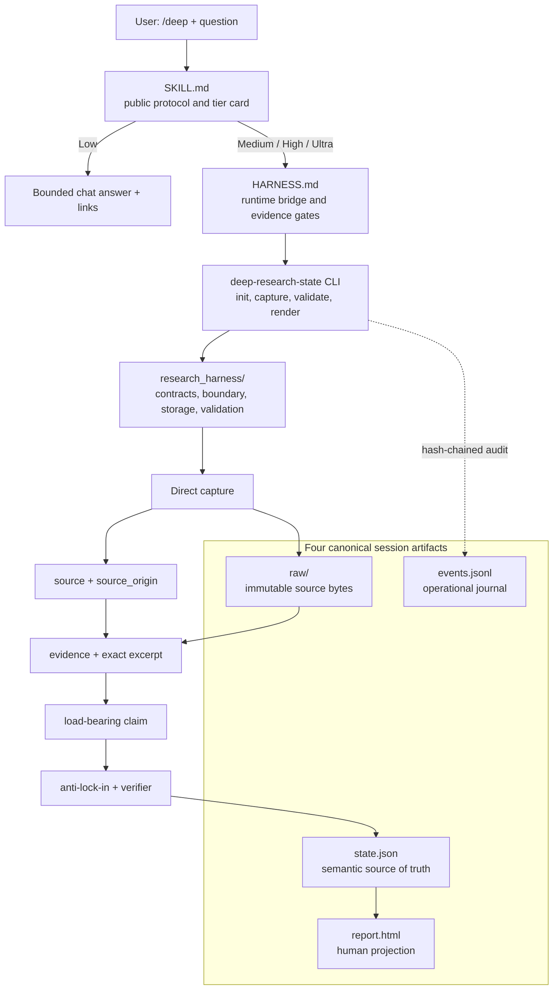

# Agent Deep Research Trigger

[](https://github.com/jechiu16/agent-deep-research-trigger/actions/workflows/ci.yml)
[](https://github.com/jechiu16/agent-deep-research-trigger/releases)
[](LICENSE)

**給 coding agent 的研究，最後應該是一個可執行的判斷，而不是一疊看似
合理的長文。** 這個可攜式 `/deep` skill 讓 Claude Code 與 OpenAI Codex
能有邊界、有證據地研究困難問題，並把結果交給下一個 coding session。

[English](README.md) · [Releases](https://github.com/jechiu16/agent-deep-research-trigger/releases)

## 為什麼需要它

直接呼叫 Deep Research 很適合探索，但用在開發時常留下三個問題：請求成本
不夠清楚、citation 未必真的支持關鍵 claim，以及下一個 session 必須重讀
整份長報告。`/deep` 適合希望保留研究廣度，同時得到有界結論、明確不確定性、
直接證據與可執行 handoff 的開發者。

## 產出長什麼樣

Low 在對話中給出簡潔回答與連結。Medium、High、Ultra 會建立一個 session
package，包含四個 canonical artifacts：machine state、audit journal、不可變的
來源 bytes，以及繁體中文 HTML 報告。真正交給下一個 session 的內容刻意很短：

> 建議 · 支持證據 · 限制與 flip conditions · 下一個可逆 coding action 與
> acceptance tests

下一個 agent 讀 `state.json`，人讀 `report.html`；兩者綁定同一份 evidence 與
status，不會各自收到一份重新生成、可能互相漂移的報告。

## 品質怎麼來

- Load-bearing claims 必須追溯到 direct capture 的 exact excerpt；provider
  synthesis 可以協助 discovery，但不能冒充 evidence。
- 證據或交付不足時 fail closed 為 `BLOCKED`，不會方便地標成 `PASS`；High
  與 Ultra 另有 anti-lock-in 與 context-separated verifier。
- 目前保留的兩次 identity-blind output comparison，都偏好 `/deep` 的產出；
  這是有界範例，不代表普遍優越性或 provider ranking。

## Architecture



## Glossary

- **Organizer：** 當下選用的 Claude Code 或 Codex host model；負責 framing、
  evidence reconciliation、最終 verdict 與 coding handoff。
- **D1 / D2：** Ultra 卡片預先授權的 exact Deep Research submits。D1 先執行；
  High checkpoint 後，由 Organizer 決定停止或使用 optional D2。
- **Anti-lock-in：** 主動嘗試推翻 provisional conclusion；每個結果都必須被
  refute、吸收進修正版，或留下具名 tension。
- **Direct capture：** 直接取得的 source bytes、exact excerpt 與 provenance；
  只有符合門檻的 capture 能支持 canonical claims。
- **Source-origin independence：** evidence 來自真正不同的上游 origin，而不是
  兩個 URL、mirror、index 或 model 重複同一來源。
- **Context-separated verifier：** 由未產生 candidate 的 actor 重新檢查 final
  claim packet；它能檢查 packet，但本身不證明 source 或 context independence。

## 快速開始

1. **安裝指定 tag 的完整 skill 與 runtime。**

```bash
git clone https://github.com/jechiu16/agent-deep-research-trigger.git \
  "$HOME/.agent-deep-research-trigger"
cd "$HOME/.agent-deep-research-trigger"
git checkout v2.0.0b8
python3 -m venv .venv
.venv/bin/python -m pip install -e .
```

2. **連結到一個 host。**

```bash
# Claude Code
mkdir -p "$HOME/.claude/skills"
ln -s "$PWD" "$HOME/.claude/skills/deep"

# 或 OpenAI Codex
mkdir -p "$HOME/.agents/skills"
ln -s "$PWD" "$HOME/.agents/skills/deep"
```

3. **開啟新的 session，** 讓 host 載入這個 skill。

4. **輸入 `/deep` 與研究問題，再選擇 tier。**

```text
/deep 比較 SQLite 與 DuckDB，哪個更適合當本機分析引擎預設值？
```

## Tiers

| Tier | 結果 |
|---|---|
| Low | 在對話中回答並附上連結；不建立研究套件。 |
| Medium | 為具名缺口補上直接證據，並交付研究套件。 |
| High | 取得至少兩份符合門檻的直接來源紀錄，並交付研究套件。 |
| Ultra | High 加 adaptive Deep loop；卡片列出 exact D1 與 optional D2 route，總上限為 1 或 2 發，由 Organizer 在 envelope 內停止或使用 D2。 |

預設使用 host-native 路徑。只有卡片已揭露時，才使用 optional external provider。
初始 Ultra 卡片會從 OpenAI、Perplexity、Gemini 中列出 exact D1 與 exact optional D2 route；Organizer 只在該 envelope 內決定停止或執行 D2。Provider synthesis 僅供 discovery，claims 由 direct captures 支持。

## 輸出

Medium、High 與 Ultra 交付：

| Output | 用途 |
|---|---|
| `state.json` | Canonical JSON，包含 machine-readable state、claims 與 evidence links。 |
| `events.jsonl` | Hash-chained operational 與 revision journal。 |
| `raw/` | 不可變、具 hash、受 policy gate 管理的 source 與 local bytes。 |
| `report.html` | `zh-Hant-TW` 結論、限制、status 與 coding handoff。 |

證據或交付有缺口時仍會交付受阻的研究套件，絕不標為 `PASS`；HTML
會依情況標示 `EVIDENCE_INSUFFICIENT` 或 `DELIVERY_INCOMPLETE`。

## 兩個有界範例

- [SQLite WAL 盲測](examples/paired/2026-07-13-sqlite-wal-blind/)：一次 identity-blind output comparison，不能證明普遍優於其他方案。
- [RFC 9110 Ultra 盲測](examples/paired/2026-07-13-rfc9110-ultra-blind/)：僅為 output-level integration evidence，不代表 full-runtime、普遍優越性或 provider ranking。

兩套材料均保留 user-visible task、candidate outputs、verdict materials 與 provenance。

## 專案連結

- [SKILL.md](SKILL.md)：公開 `/deep` protocol
- [HARNESS.md](HARNESS.md)：Medium/High/Ultra internal runtime bridge 與 gates
- [examples/v2](examples/v2)：runtime fixture
- [CONTRIBUTING.md](CONTRIBUTING.md)：開發與 release checks
- [SECURITY.md](SECURITY.md)：private security reporting

## License

[MIT](LICENSE)
